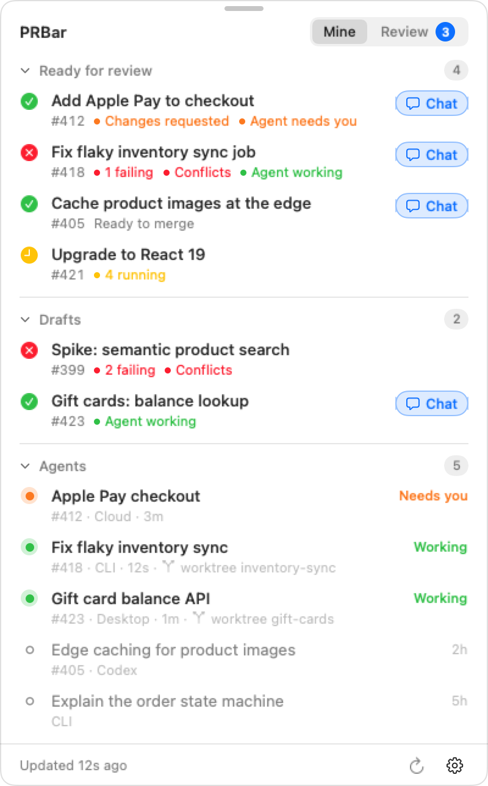
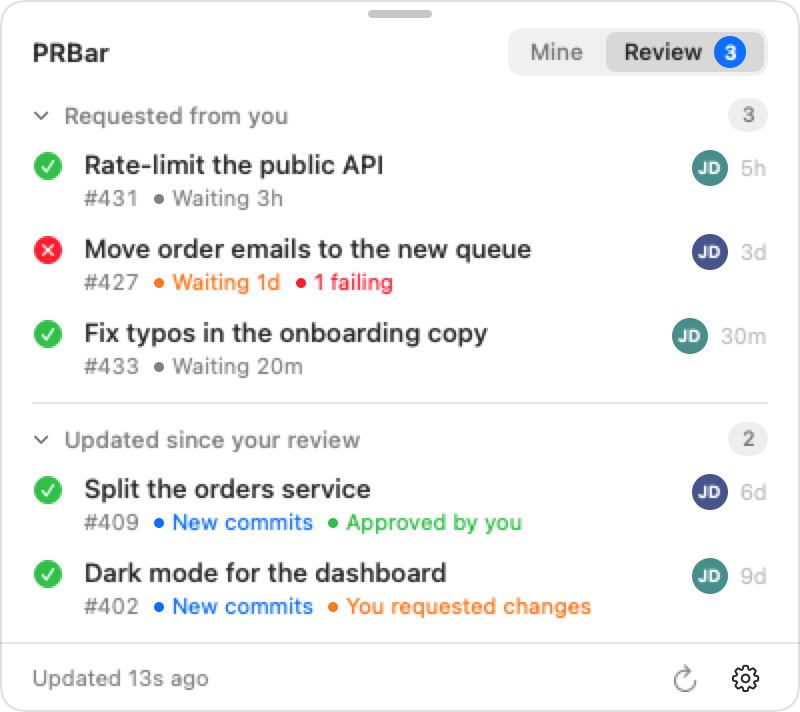

# PRBar

A macOS menu bar app that shows your open GitHub PRs together with the AI agents working on them (Claude Code CLI, Claude Desktop, IDE and cloud sessions, and Codex), live.

<p align="center">
  <picture>
    <source media="(prefers-color-scheme: dark)" srcset="docs/panel-mine-dark.png">
    
  </picture>
  <picture>
    <source media="(prefers-color-scheme: dark)" srcset="docs/panel-review-dark.png">
    
  </picture>
</p>

The menu bar shows counts with the same icons: PRs ready for review (green), drafts (grey), PRs failing CI or with conflicts (✗), and ◐ when an agent needs you.

PRs are split into **Ready for review** and **Drafts**. Within each section they're sorted by what needs attention: agents waiting on you, then failing CI or conflicts, then review feedback, then in-progress work, then quiet PRs. 

PR rows list what needs attention under the title: failing or running checks, conflicts, changes requested, unresolved threads, and whether an agent on it is working or needs you. A PR with nothing in the way says **Ready to merge** (or **Awaiting review** while a required review is missing). Click a section heading to fold it; PRBar remembers which ones you folded.

The **Review** tab lists other people's open PRs: **Requested from you** (with how long the request has waited, orange after a day) and **Updated since your review** (PRs you reviewed that got new commits since, tagged with your review). Each row shows CI, the author's initials and the PR's age. The badge on the tab counts pending review requests.

The **Agents** section lists every running agent (Claude Code CLI, Claude Desktop, IDE, Codex, and recent cloud sessions), with the PR it's on and, for one working in a git worktree, "worktree" and the worktree's folder name after a branch icon (an agent in the main checkout shows none). Hover one to see its last prompt or recap and the folder it runs in. The menu bar counts PRs ready for review (green pull-request icon) and drafts (grey pull-request icon), the same icons as the panel's section headers, plus PRs failing CI or with merge conflicts (✗) and ◐ when an agent is waiting on you. Working agents are only shown in the panel, so the menu bar only changes when your PRs do. Hover it for a legend.

The **Chat** button on a PR opens the most recent agent chat that worked on it, running or finished, in the app it was started in:

| Latest chat | Opens |
| --- | --- |
| Claude Code, running in iTerm2 or Terminal | Switches to its tab (first use asks for Automation permission) |
| Claude Code, running in another app (Cursor, VS Code…) | Brings that app forward |
| Claude Code, finished, started in a terminal | `claude --resume <id>` in a new iTerm2 window (Terminal if iTerm2 isn't installed), in the session's folder |
| Claude Code, finished, started in Claude Desktop | Claude Desktop, via `claude://resume?session=<id>` |
| Claude Desktop session, running | Claude Desktop |
| Codex | That thread in Codex (`codex://threads/<id>`) |
| Cloud | Claude Desktop (via `claude://claude.ai/code/<id>`) if you use it, otherwise the session on claude.ai. "Uses Claude Desktop" means Claude.app is installed and has been opened at least once (`~/Library/Application Support/Claude` exists). |

Finished chats come from Claude Code transcripts and Codex threads of the last 14 days. They're linked to a PR by the PR the session opened or linked, or by the ticket id in its worktree folder or title. The checked-out branch isn't used for finished chats, because in a shared checkout it only says what happened to be checked out.

Clicking the icon opens a panel. Clicking a PR opens it on GitHub in the background, so the panel stays open and you can open several in a row. If a tab already shows that PR (or one of its pages, like Files changed), PRBar switches to that tab instead of opening another. This works in Chrome, Safari, Brave, Edge, Vivaldi and Arc (tabs in Arc's current space), and the first time macOS asks whether PRBar may control the browser. Other browsers, or a refused permission, get a new tab as before. Clicking an agent in the Agents section opens its chat the same way as the **Chat** button (see the table above). The panel closes on Esc or a click outside. To keep it open above other apps while you work, turn on **Keep Panel on Top** in the gear menu; it then closes only from the menu bar icon or Esc. Drag the panel by its header (the grab bar and title) to move it; it stays there until it closes, then opens under the menu bar icon again.

**Notifications:** PRBar posts a macOS notification when an agent starts waiting on you, one of your PRs starts failing CI or gets merge conflicts, a review approves or requests changes on your PR, or someone requests your review. Only changes notify; whatever is already true when PRBar starts, or when a PR or agent first shows up, stays quiet. Clicking a notification opens the agent's chat (like its row in the panel) or the PR in your browser. Turn them all off with **Notifications** in the gear menu, or pick which ones you get under **Notify Me When**. **Agent Finished** (an agent ended its turn) is off by default. macOS asks for permission the first time PRBar starts with this; banner style and sounds are in System Settings → Notifications → PRBar.

## Data sources

| What | Where it comes from | Refresh |
| --- | --- | --- |
| Open PRs, CI checks, review state, unresolved threads | `gh api graphql` (`viewer.pullRequests`, all repos) | 45s, and right after any local agent finishes a turn |
| Review tab | `gh api graphql` searches: `review-requested:@me` and `reviewed-by:@me -author:@me` (open, non-draft), with your latest review compared against the last commit | Same as above |
| Local Claude Code sessions (CLI, Desktop, IDE) | `~/.claude/sessions/<pid>.json` (live status) plus incremental tail of each session's transcript (`pr-link`, `ai-title`, `last-prompt`, recaps) | 3s |
| Codex threads (CLI and desktop app) | `~/.codex/state_*.sqlite` `threads` table, plus the task events at the end of each rollout log. Claude Code sessions Codex imported (listed in `external_agent_session_imports.json`) and Codex sub-agents are skipped. Idle threads are shown only while Codex is running. | 5s |
| Finished chats, for the Chat button | Claude Code transcripts in `~/.claude/projects` modified in the last 14 days (re-read only when they change), and Codex threads from the same period | 60s |
| Cloud Claude Code sessions | `api.anthropic.com/v1/code/sessions`, using the `claude` CLI's login from the keychain (read only; never refreshed here). Remote Control (`bridge`) sessions are skipped: they're local sessions mirrored to claude.ai and unreachable once that machine's session ends. A cloud session waiting for input counts as "needs you" only for 24 hours. | 30s |

Agents are linked to PRs in this order: the PR the session itself linked (`pr-link` / "PR #123" in a cloud summary), then the git branch of the session's working directory or the cloud session's branch, then the ticket id (`bli-1637`) in the worktree name or branch.

The cloud sessions endpoint is internal to Claude Code, not a public API, so it may change between versions. If it breaks, the panel shows a `Cloud:` warning and everything else keeps working.

## Install

```sh
brew install emilskovmand/tap/prbar
brew services start prbar   # start now and at every login
```

The formula lives in [emilskovmand/homebrew-tap](https://github.com/emilskovmand/homebrew-tap). It:

- builds the app from source (under a minute), so you need macOS 15+ and Xcode 16+ or its command line tools (`xcode-select --install`). The app isn't signed with an Apple developer certificate, so a downloaded copy would be blocked by Gatekeeper; a locally built one isn't.
- installs `gh` if it's missing. Log it in with `gh auth login`; PRBar reads your PRs through it.
- adds a `prbar` command, so `prbar --dump` works from any terminal.
- adds PRBar to Spotlight (see below).
- sets up `brew services`, which starts PRBar at login. In a Homebrew install the gear menu's **Open at Login** is replaced by a button that copies `brew services start prbar`, because a login item would point at the versioned Cellar folder and break on upgrade.

| Task | Command |
| --- | --- |
| Open it after quitting | Search for **PRBar** in Spotlight, or `brew services restart prbar` |
| Run once without the service | `open $(brew --prefix)/opt/prbar/PRBar.app` |
| Upgrade | Click **Update** in the panel, or `brew upgrade prbar && brew services restart prbar` |
| Stop and remove | `brew services stop prbar && brew uninstall prbar && rm -rf ~/Applications/PRBar.app` |

**Updates:** Homebrew doesn't upgrade packages on its own. Instead, PRBar checks GitHub for a newer release tag at launch and every 6 hours (and when you press refresh). It asks through `gh` when that's installed and logged in, because unauthenticated requests share a limit of 60 an hour with everything else on your network, and falls back to a plain request otherwise. When there is one, the panel footer shows **Update available**. Clicking **Update** runs `brew update` and `brew upgrade emilskovmand/tap/prbar`, then restarts PRBar: through launchd when it runs under `brew services`, otherwise by opening the new version before quitting. Source builds show a **View** button that links to these instructions instead.

**Spotlight:** Spotlight doesn't index Homebrew's folders, so the Homebrew copy adds a small launcher app at `~/Applications/PRBar.app` when it starts. Opening it from Spotlight or Finder starts PRBar through `brew services` if it isn't running, so it stays the background service, or runs PRBar directly if the service was never set up. If PRBar is already running, it shows the panel instead. The launcher only points at `$(brew --prefix)/opt/prbar`, which follows upgrades, so it never needs updating by hand. PRBar rewrites it only when the launcher itself changes.

**Switching from a source build:** quit the copy in `~/Applications` (gear menu → Quit PRBar) and turn off its **Open at Login** first if you enabled it. When the Homebrew copy starts, it moves the old `~/Applications/PRBar.app` to the Trash and puts its launcher there. Anything else at that path that isn't PRBar is left alone.

## Build from source

Requires macOS 15+, Xcode command line tools, and an authenticated `gh` CLI.

```sh
./scripts/build-app.sh            # builds build/PRBar.app
./scripts/build-app.sh --install  # copies to ~/Applications and launches it
```

When built this way, enable **Open at Login** from the gear menu in the panel to start it automatically. Don't mix this with a Homebrew install: whenever the Homebrew copy starts, it moves a source build in `~/Applications` to the Trash and replaces it with its Spotlight launcher.

## Releasing

Homebrew installs a tagged release, so changes on `main` reach brew users only after a new tag and a formula update:

1. Tag and push: `git tag v0.1.2 && git push origin v0.1.2`
2. Get the checksum of the tag's archive:
   ```sh
   curl -sL https://github.com/emilskovmand/prbar/archive/refs/tags/v0.1.2.tar.gz | shasum -a 256
   ```
3. In [homebrew-tap](https://github.com/emilskovmand/homebrew-tap), update `url` and `sha256` in `Formula/prbar.rb`, then commit and push.
4. Within 6 hours, running copies show **Update available**. Users can also run `brew upgrade prbar && brew services restart prbar`.

The formula stamps the release version into the app's `Info.plist`, and the update check compares against it. `scripts/build-app.sh` stamps `git describe --tags` instead.

Always use a new tag; don't move an existing one. GitHub caches tag archives, so a moved tag keeps serving the old code and its old checksum.

`brew install --HEAD emilskovmand/tap/prbar` builds the latest `main` without a release.

## Debugging

```sh
swift build -c release && .build/release/PRBar --dump
```

This polls every source once and prints what the panel would show. `PRBar --snapshot out.png` renders the panel to an image. `PRBar --demo-screenshots docs` renders the README screenshots (both tabs, dark and light) from the made-up PRs in `Sources/PRBar/Demo.swift`.
